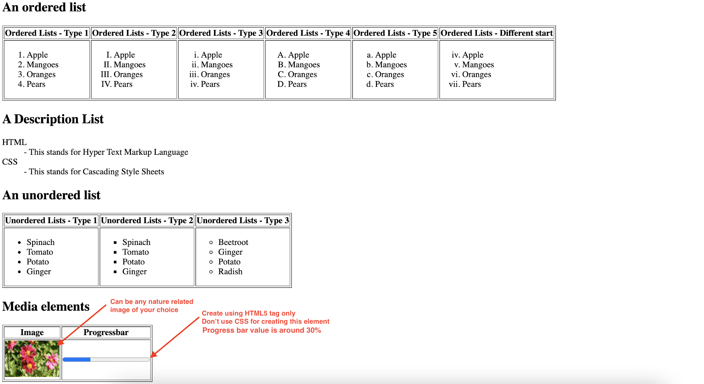

### Guidelines:
* This assignment is mandatory for everyone
* There will only be a single attempt for each exam and no deadline extension in case of assignments
*  Any case of unfair means or plagiarism would lead to debarring in final placements without any further consideration.
* The images of the applications are only for reference, the app design can be different but all the components mentioned in the image of the apps should be present.

### Problem 1:-
Build three tables with information as shown in below screenshot using only HTML tags

### Problem 2:-
Build a various elements shown below using tables and other HTML tags without using CSS

### Problem 3:-
Build a product listing page as shown in below screenshot

You can build the page for any other product of your choice but make sure to include
all the product details.
### Resources used in the sample design: 
* Shirt Image:- https://pixabay.com/photos/isolated-t-shirt-tshirt-t-shirt-1852114/
* Star rating icon is from font awesome library:-
* List of icons:- https://fontawesome.com/cheatsheet
* CSS link:- https://cdnjs.com/libraries/font-awesome Icon
* Tutorial:- https://www.w3schools.com/icons/fontawesome_icons_intro.asp

## Approach:-

* For each problem make 3 different folder with respective js/css/html files to put logic
* Now make 3 links in index.html file that href to thouse different pages and your problem will run on replit
for reference watch [Link](https://www.youtube.com/watch?v=SHjKyQZ6wo8)