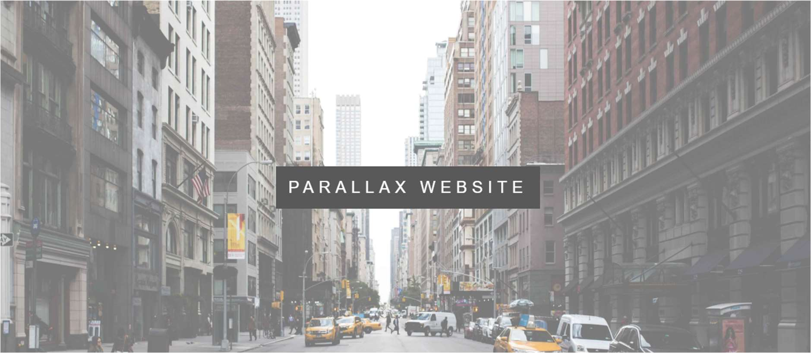
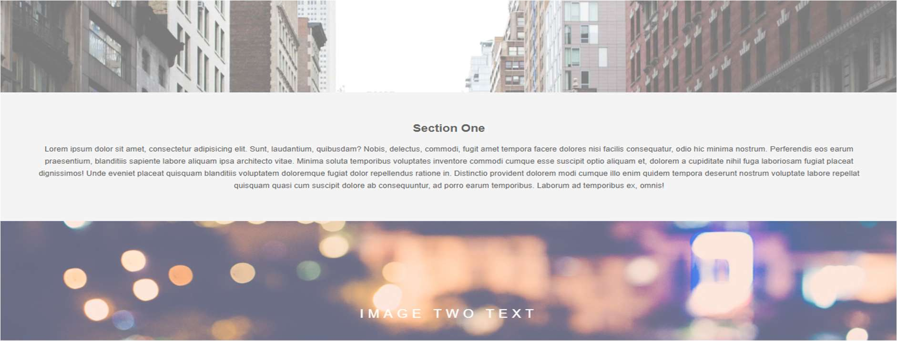
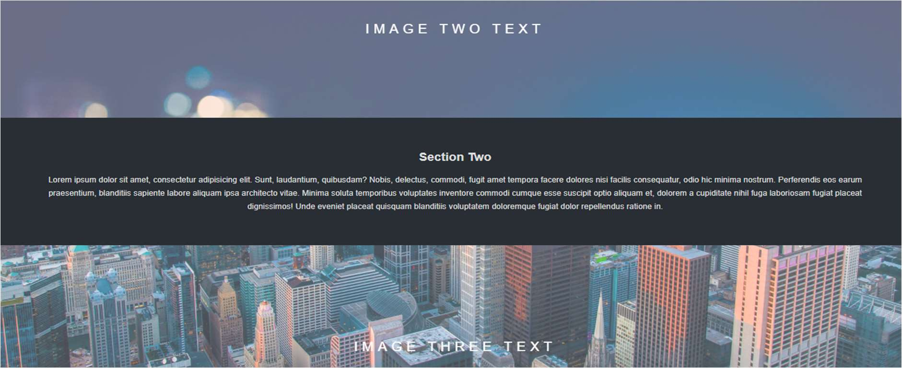
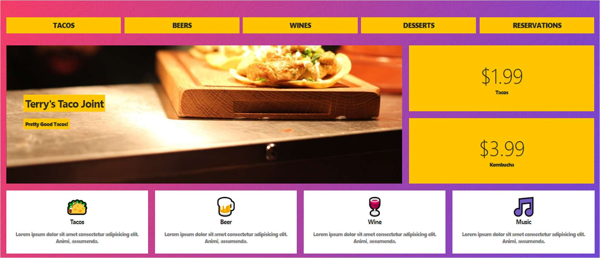
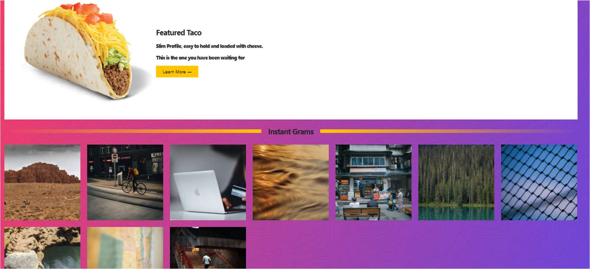
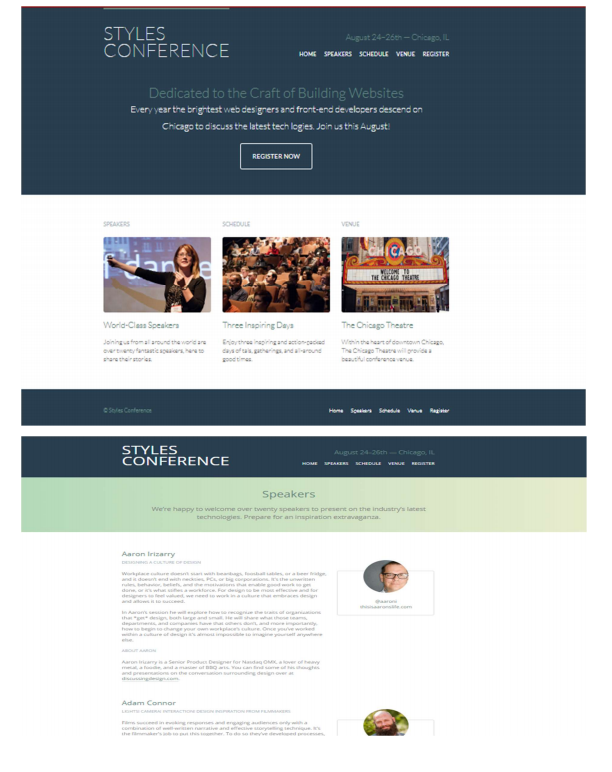
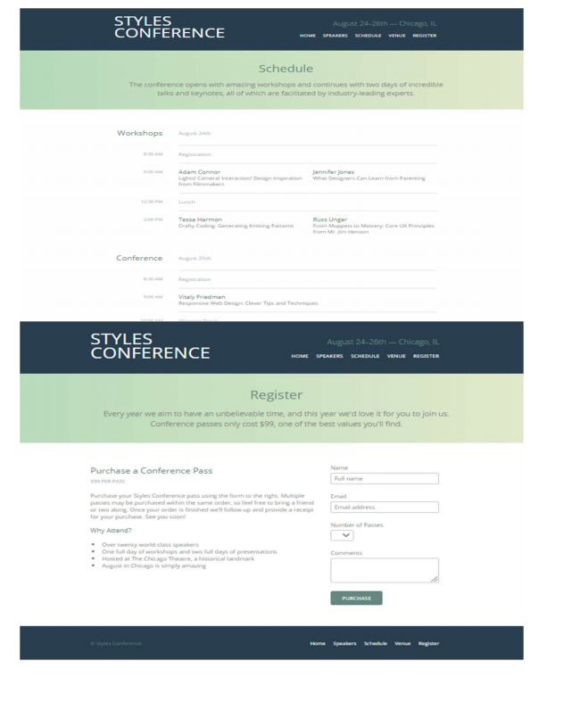

# Front End Development Assignment
### Guidelines:-
* This assignment is mandatory for everyone
* There will only be a single attempt for each exam and no deadline extension in case of assignments
* Any case of unfair means or plagiarism would lead to debarring in final placements without any further consideration.
* The images of the applications are only for reference, the app design can be different but all the components mentioned in the image of the apps should be present.

## Problem 1
Create a Parallax website. A parallax website includes fixed images in the background that 
you can keep in place and you can scroll down the page to see different parts of the image. 
Divide the whole page into three to four different sections. Set 3-4 background images, align 
the text for different sections, set margin and padding, add background-position and other 
CSS elements and properties to create a parallax effect.

## Problem 2 :-
Create a Restaurant website. You will be aligning the different food items and drinks using a 
CSS layout grid. You will be adding prices, images and you need to give it a beautiful look 
and feel as well using the proper combination of colors, font-style and images. You can add 
pictures gallery for different food items, you can also add sliding images for a better look. 
Add links for redirection to internal pages. Make it responsive setting a viewport, using 
media queries and grid.

## Problem 3:-
Create an Event Website. You can make a static page holding an event or conference. 
People who are interested in attending the conference create a register button for them. 
Mention different links for speaker, venue and schedule at the top in the header section. 
Describe the purpose of the conference or the category of people who can get benefit from 
this conference. Add an introduction and images of the speaker, venue detail and the main
purpose of the conference on your webpage. Divide the page into sections, add header and 
footer showcasing the menu. Use proper background color that can go well with each other 
for various sections. Choose a decent font style and font color that matches the theme of 
your web page.

## Approach:-

* For each problem make 3 different folder with respective js/css/html files to put logic
* Now make 3 links in index.html file that href to thouse different pages and your problem will run on replit
for reference watch [Link](https://www.youtube.com/watch?v=SHjKyQZ6wo8)